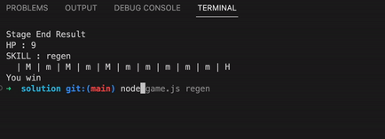

## Summary


this the simulation from the game :)



## Releases

### Release 0 : Implement `process argv`

Hero need skill before game. in this release, game need input from user to decide what skill hero use on the game. you can type `regen` or `ulti`

you can use `process argv` on the skeleton code

```sh

$ node game.js regen

```

or

```sh

$ node game.js ulti

```

**Note**:

- skill only `ulti` or `regen` other than that console error on cli

### Release 1 : Implement Using the Skeleton Code

after that make algorithm that require some rule in the game.

**Rule**:

- there is 10 stage.
- there is preparation stage and end stage.
- Hero have max 100hp.
- Every stage have a monster. that can be killed by one hit by hero but hero got damaged and hp got -7
- There is 30% possibility in every stage got big monster that must 2 hit to kill the monster. in every hit hero got hp -7
- Hero just have 10% chance to use the skill in every stage.
- if Hero use regen skill the get +10hp(max 100hp) and ulti skill can kill i hit kill every kind of monster buy still got damaged hp -7
- if Hero still have hp>0 in end stage then player win
- if Hero still have hp === 0 in end stage then player lose.
- the minimum hp must 0 not negatif
- Show stats like hp and skill on top in cli in every stage
- if there is fight, there is a log below arena

Use libaray [ASCII art ini](https://www.npmjs.com/package/ascii-art) if you want experiment with color, font, etc to you console.

